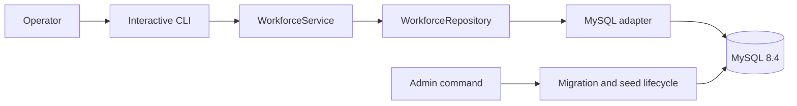
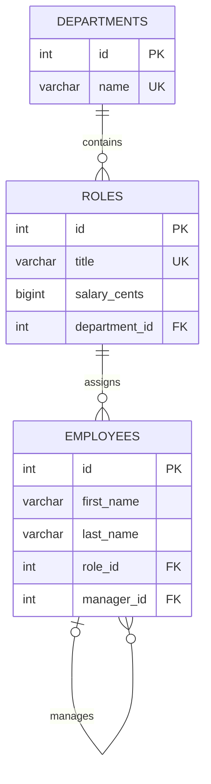

# Workforce Operations Console

[](https://github.com/Rickythakar/employee-management-system/actions/workflows/ci.yml)
[](https://github.com/Rickythakar/employee-management-system/actions/workflows/codeql.yml)
[](https://nodejs.org/)
[](https://www.typescriptlang.org/)
[](LICENSE)

A production-grade terminal application for managing departments, roles, reporting lines, and workforce budgets. It combines a fast interactive operator experience with explicit domain rules, versioned MySQL migrations, automated security checks, and real-database integration tests.

## What it does

- View joined employee, role, department, manager, and compensation data.
- Add departments, roles, and employees through guided prompts.
- Change employee roles and reporting lines.
- Prevent self-management and indirect management cycles.
- Protect referenced departments, assigned roles, and managers from unsafe deletion.
- Report organization totals and annual payroll by department.
- Migrate, seed, health-check, and smoke-test MySQL through one administration command.

## Quick start

### Requirements

- Node.js 22.13 or newer
- pnpm 11
- Docker with Compose, or an accessible MySQL 8.4 instance

### Local development

```bash
cp .env.example .env
# Replace the example password in .env before continuing.

docker compose up -d db
pnpm install --frozen-lockfile
pnpm db:migrate
pnpm db:seed
pnpm smoke
pnpm dev
```

The seeded organization contains three departments, four roles, four employees, reporting lines, and a $520,000 annual payroll. Re-running the seed command is safe and deterministic.

### Container-only operation

```bash
cp .env.example .env
docker compose up -d db
docker compose build app
docker compose run --rm app sh -c "node dist/admin.js migrate && node dist/admin.js seed"
docker compose run --rm app
```

The application container runs as an unprivileged user and applies pending migrations before opening the interactive console.

## Operator workflow

```text
Workforce Operations Console
? What would you like to do?
❯ Organization summary
  View departments
  View roles
  View employees
  View department budgets
  Add a department
  Add a role
  Add an employee
  Change an employee role
  Change an employee manager
  Remove an employee
  Remove a role
  Remove a department
  Exit
```

Every destructive action requires confirmation. Dependency and reporting-line errors are explained without ending the session.

## Architecture





MySQL owns persisted truth and relational constraints. `WorkforceService` owns validation and workflow rules. The CLI does not issue SQL, and the persistence adapter does not prompt users. See [the architecture decision](docs/architecture/001-service-repository-boundary.md) for the reasoning.

## Commands

| Command                 | Purpose                                                        |
| ----------------------- | -------------------------------------------------------------- |
| `pnpm dev`              | Run the interactive TypeScript application                     |
| `pnpm db:bootstrap`     | Create the configured database when the account has permission |
| `pnpm db:migrate`       | Apply checksum-verified migrations under an advisory lock      |
| `pnpm db:seed`          | Load deterministic demonstration data                          |
| `pnpm db:health`        | Verify database connectivity                                   |
| `pnpm smoke`            | Prove that migrated and seeded data is readable                |
| `pnpm test:unit`        | Run fast domain and CLI tests                                  |
| `pnpm test:integration` | Run the real-MySQL repository lifecycle test                   |
| `pnpm coverage`         | Enforce application coverage thresholds                        |
| `pnpm check`            | Run formatting, linting, types, tests, and build               |
| `pnpm build`            | Compile the production distribution                            |

Integration tests require `RUN_INTEGRATION_TESTS=true` and the database variables from `.env.example`. CI provisions MySQL automatically.

## Production safeguards

- Strict TypeScript and a repository boundary keep SQL and user interaction isolated.
- Credentials come only from environment configuration and are validated at startup.
- Compensation is stored as integer cents to avoid floating-point errors.
- Foreign keys and checks reinforce service-level deletion and self-management rules.
- Migration checksums detect edits to already-applied database history.
- CI runs formatting, linting, type checking, coverage, MySQL integration, smoke, build, and dependency audit gates.
- CodeQL and Dependabot continuously inspect the public repository.

For configuration, backup, restore, migration recovery, and incident steps, read the [operations guide](docs/operations.md). Security issues should follow [the private reporting process](SECURITY.md).

## Development

Contributions are welcome. Start with [CONTRIBUTING.md](CONTRIBUTING.md), add tests before behavior changes, and keep commits focused. The current production line is documented in [CHANGELOG.md](CHANGELOG.md).

## License

Released under the [MIT License](LICENSE).
